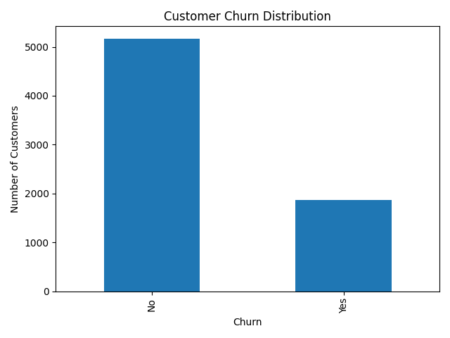
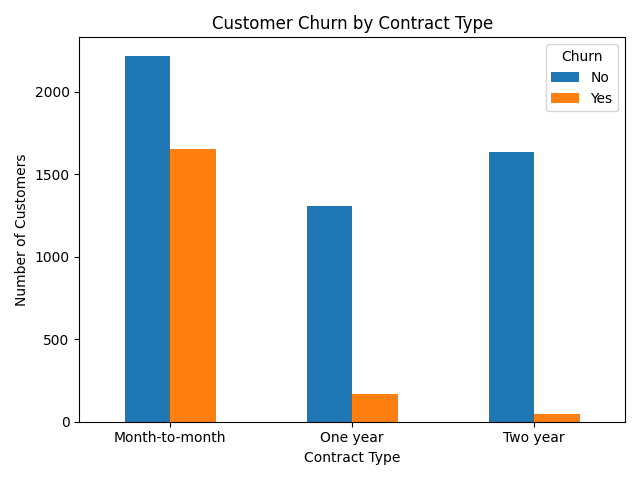
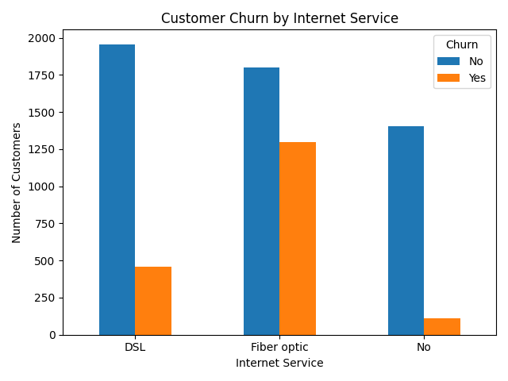
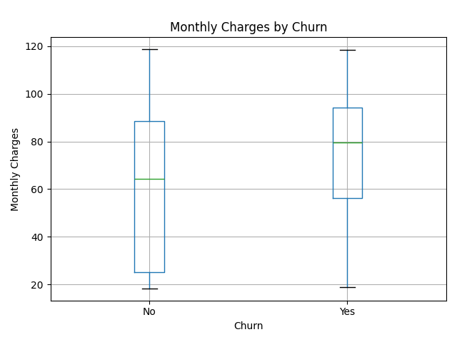
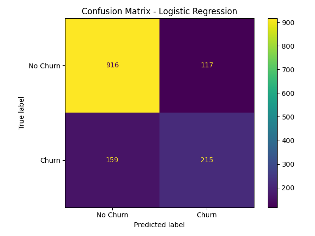

# Customer Churn Prediction

### End-to-End Machine Learning Project | Telecom Customer Analytics

Predicting customer churn using Machine Learning techniques by analyzing customer demographics, services, contract information, and billing behavior.

---

## 📊 Project Snapshot

| Metric | Result |
|---|---:|
| Dataset Size | 7,043 customers |
| Features | 20+ |
| Models Implemented | 2 |
| Logistic Regression Accuracy | **80.38%** |
| Random Forest Accuracy | **78.68%** |
| Churn F1-Score | **61%** |

---

## 🎯 Problem Statement

Customer churn is an important challenge for subscription-based businesses.

The objective of this project is to analyze customer behavior and develop a Machine Learning classification system that predicts whether a customer is likely to churn.

This project follows an end-to-end Machine Learning workflow, from raw customer data preprocessing to model training, evaluation, comparison, and model persistence.

---

## 🧠 Project Highlights

- Data Cleaning & Preprocessing
- Exploratory Data Analysis
- Feature Engineering
- Categorical Variable Encoding
- Feature Scaling
- Machine Learning Classification
- Model Evaluation
- Model Comparison
- Confusion Matrix Analysis
- Model Serialization

---

## 🗂️ Dataset

This project uses the **Telco Customer Churn Dataset**.

The dataset contains customer information related to:

- Customer demographics
- Tenure
- Contract type
- Internet service
- Payment method
- Monthly charges
- Total charges
- Phone services
- Online services
- Customer churn

### Target Variable

`Churn`

- `Yes` → Customer churned
- `No` → Customer did not churn

---

## 🔄 Machine Learning Pipeline

```text
Raw Dataset
     ↓
Data Cleaning
     ↓
Exploratory Data Analysis
     ↓
Feature Engineering
     ↓
Categorical Encoding
     ↓
Train / Test Split
     ↓
Feature Scaling
     ↓
Model Training
     ↓
Model Evaluation
     ↓
Model Comparison
     ↓
Model Serialization
```

---

## 🧹 Data Preprocessing

The following preprocessing steps were implemented:

1. Loaded the dataset using Pandas
2. Inspected dataset shape and columns
3. Checked missing values
4. Converted `TotalCharges` to numeric format
5. Removed rows containing missing `TotalCharges`
6. Removed the `customerID` identifier
7. Converted the target variable into binary values
8. Applied One-Hot Encoding to categorical variables
9. Split the dataset into training and testing sets
10. Applied `StandardScaler` for feature scaling

### Data Cleaning Result

**Before Cleaning**

```text
Rows    : 7,043
Columns : 21
```

**After Cleaning**

```text
Rows    : 7,032
Columns : 21
```

**11 rows** containing missing `TotalCharges` values were removed.

---

# 📈 Exploratory Data Analysis

## Customer Churn Distribution

The dataset contains substantially more non-churned customers than churned customers.



---

## Churn by Contract Type

The analysis shows a substantially higher number of churned customers among month-to-month contract customers in this dataset.



### Observed Pattern

```text
Month-to-month  → Higher churn count
One year        → Lower churn count
Two year        → Lower churn count
```

These observations represent patterns found in the dataset and do not establish causal relationships.

---

## Churn by Internet Service

Customer churn was also analyzed across different internet service categories.



---

## Monthly Charges by Churn

Monthly charges were compared between customers who churned and customers who did not churn.



---

# 🤖 Machine Learning Models

Two classification algorithms were implemented and evaluated using the same train-test split.

## 1. Logistic Regression

Logistic Regression was used as the primary baseline classification model.

### Performance

| Metric | Score |
|---|---:|
| Accuracy | **80.38%** |
| Churn Precision | **65%** |
| Churn Recall | **57%** |
| Churn F1-Score | **61%** |

---

## 2. Random Forest

Random Forest was implemented as a second classification approach for comparison.

### Performance

| Metric | Score |
|---|---:|
| Accuracy | **78.68%** |
| Churn Precision | **62%** |
| Churn Recall | **50%** |
| Churn F1-Score | **56%** |

---

# ⚖️ Model Comparison

| Model | Accuracy | Churn F1-Score |
|---|---:|---:|
| Logistic Regression | **80.38%** | **61%** |
| Random Forest | **78.68%** | **56%** |

On this test split, Logistic Regression achieved higher accuracy and churn-class F1-score than Random Forest.

---

# 📌 Confusion Matrix

The confusion matrix below shows the prediction performance of the Logistic Regression model.



### Logistic Regression Test Results

```text
True Negatives  : 916
False Positives : 117
False Negatives : 159
True Positives  : 215
```

The model correctly identified a substantial portion of both churned and non-churned customers while also producing false positive and false negative predictions.

---

# 💡 Business Insights

### Contract Type

Month-to-month customers represented the highest churn count in the analyzed dataset.

### Customer Retention

Longer-term contracts showed considerably fewer churned customers compared with month-to-month contracts.

### Customer Charges

Monthly charges were analyzed to understand their relationship with observed churn patterns.

### Customer Behavior

Customer service usage, contract information, tenure, and billing characteristics provide useful signals for churn prediction.

> These insights describe relationships observed in the dataset and should not be interpreted as causal conclusions.

---

# 🛠️ Technology Stack

### Programming Language


### Data Analysis


### Machine Learning


### Visualization


### Model Persistence


### Development Tools


---

# 📁 Project Structure

```text
Customer_Churn_Prediction/
│
├── data/
│   └── Telco-Customer-Churn.csv
│
├── models/
│   ├── logistic_regression_model.pkl
│   └── scaler.pkl
│
├── results/
│   ├── churn_by_contract.png
│   ├── churn_by_internet_service.png
│   ├── confusion_matrix_logistic_regression.png
│   ├── customer_churn_distribution.png
│   └── monthly_charges_by_churn.png
│
├── src/
│   ├── data_preprocessing.py
│   ├── eda.py
│   └── train_model.py
│
├── README.md
└── requirements.txt
```

---

# ⚙️ Installation

### Clone the Repository

```bash
git clone https://github.com/mansikapse04/Customer_Churn_Prediction.git
```

### Navigate to the Project

```bash
cd Customer_Churn_Prediction
```

### Install Dependencies

```bash
pip install -r requirements.txt
```

---

# ▶️ Running the Project

### 1. Data Preprocessing

```bash
python src/data_preprocessing.py
```

### 2. Exploratory Data Analysis

```bash
python src/eda.py
```

### 3. Model Training & Evaluation

```bash
python src/train_model.py
```

The training script performs:

- Data preprocessing
- Feature preparation
- Train-test splitting
- Feature scaling
- Logistic Regression training
- Random Forest training
- Model evaluation
- Model comparison
- Model saving

---

# 💾 Saved Models

The trained Logistic Regression model and preprocessing scaler are saved using Joblib.

```text
models/
│
├── logistic_regression_model.pkl
└── scaler.pkl
```

These artifacts can be reused for future prediction workflows.

---

# 📊 Results Summary

| Model | Accuracy | Precision | Recall | F1-Score |
|---|---:|---:|---:|---:|
| Logistic Regression | **80.38%** | **65%** | **57%** | **61%** |
| Random Forest | **78.68%** | **62%** | **50%** | **56%** |

The evaluation indicates that, on the selected test split, Logistic Regression produced stronger results than Random Forest across the reported metrics.

---

# 🚀 Future Improvements

The project can be extended with:

- Hyperparameter tuning
- Cross-validation
- Class imbalance handling
- ROC-AUC analysis
- Precision-Recall analysis
- Feature importance analysis
- XGBoost implementation
- Gradient Boosting models
- Streamlit prediction interface
- Model deployment
- Real-time customer churn prediction API

---

# 📚 Key Learning Outcomes

This project provided hands-on experience with:

- Data preprocessing
- Missing value handling
- Exploratory Data Analysis
- Data visualization
- Feature engineering
- One-Hot Encoding
- Feature scaling
- Classification algorithms
- Logistic Regression
- Random Forest
- Model evaluation
- Confusion matrix
- Model comparison
- Model serialization
- Git & GitHub workflow

---

# 👩‍💻 Author

## Mansi Kapse

**B.Sc. Computer Science | Data Science & AI**

### Areas of Interest

`Data Science` · `Machine Learning` · `Artificial Intelligence` · `Data Analytics`

### Connect

**GitHub:**  
https://github.com/mansikapse04

**LinkedIn:**  
https://www.linkedin.com/in/mansi-kapse-575b02399/

---

## ⭐ Project Status

**Completed — Initial Machine Learning Implementation**

This project is structured for further experimentation with advanced models, hyperparameter tuning, deployment, and real-time prediction.